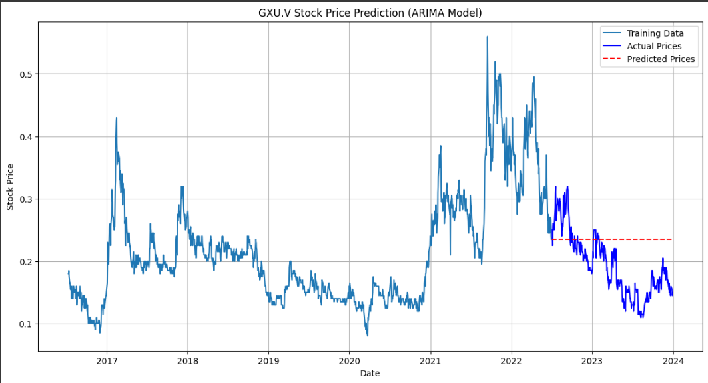

# Stock Price Prediction (GXU.V)

This project explores **time-series forecasting** of stock prices using two approaches:  

- **LSTM (Long Short-Term Memory)** – a deep learning model suitable for sequential data.  
- **ARIMA (AutoRegressive Integrated Moving Average)** – a statistical model for time-series forecasting.  

We compare both methods on the **GXU.V stock** dataset (2015–2023).  

## Setup

### 1. Clone Repository
```bash
git clone https://github.com/tirzahx/stox.git
cd stox
```

### 2. Install Dependencies

#### For **LSTM** (TensorFlow-based):
```bash
pip install -r requirements.txt
```

#### For **ARIMA** (separate environment recommended):
```bash
python -m venv venv-arima
source venv-arima/bin/activate  # Windows: venv-arima\Scripts\activate
pip install -r requirements-arima.txt
```

## Usage

### Step 1: Data Preprocessing
```bash
python data_preprocessing.py
```

### Step 2: Run LSTM Model
```bash
python lstm_model.py
```

### Step 3: Run ARIMA Model
```bash
# Activate ARIMA environment first
python arima_model.py
```


## Results

| Model   | RMSE | MAE |
|---------|------|-----|
| **LSTM**  | 0.01 | 0.01 |
| **ARIMA** | 0.06 | 0.05 |

- **LSTM outperforms ARIMA** in both error metrics, showing better ability to capture stock price patterns.  
- **ARIMA** provides a simpler, interpretable baseline.  

## Visualizations

### LSTM Predictions vs Actual  
  

### ARIMA Predictions vs Actual  
  
